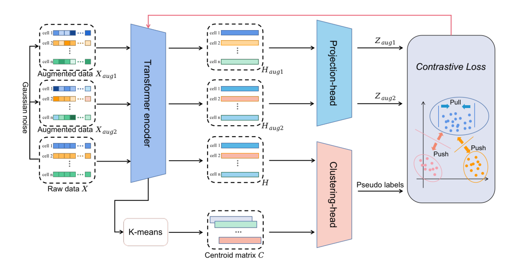
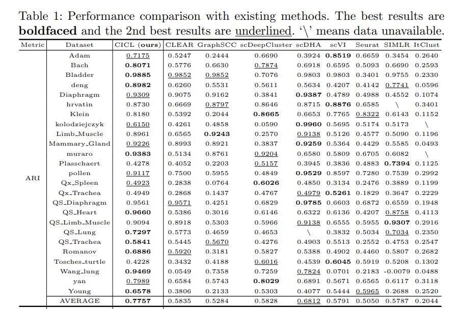

# scRNA-seq Data Clustering by Cluster-aware Iterative Contrastive Learning
This repository is the official implementation of "scRNA-seq Data Clustering by **C**luster-aware **I**terative **C**ontrastive **L**earning"（CICL）
## Overview

The proposed model CICL employs a typical model structure of contrastive learning as the backbone.By utilizing an iterative representation learning
and clustering framework with a cluster-aware contrastive loss, it can progressively improve the clustering result by comprehensively exploiting the hidden
cluster structure for scRNA-seq data representation.

## Results

Clustering performance(ARI) comparison with other methods on various datasets.

## Requirements
python 3.10.9  
pytorch 1.13.1(cuda11.7)  
h5py 3.8.0  
hdf5 1.10.6   
scanpy 1.9.3  
scikit-learn 1.0.2  
scipy 1.10.1  
For whole environment information,check requirements.txt.

## Datasets
The real scRNA-seq datasets used in this paper can be downloaded in <a href="https://drive.google.com/drive/folders/1BIZxZNbouPtGf_cyu7vM44G5EcbxECeu">here</a>.

## Quick start
Place the preprocessed datasets in ./preprocess/data/ with the name DATASETNAME_preprocessed_counts.csv and DATASETNAME_preprocessed_labels.csv.
```shell
python3 -m torch.distributed.launch --nproc_per_node=4 main.py --objective para
```
**Note:** to change the datasets to run,modify the variable "datasets" in main.py directly.


